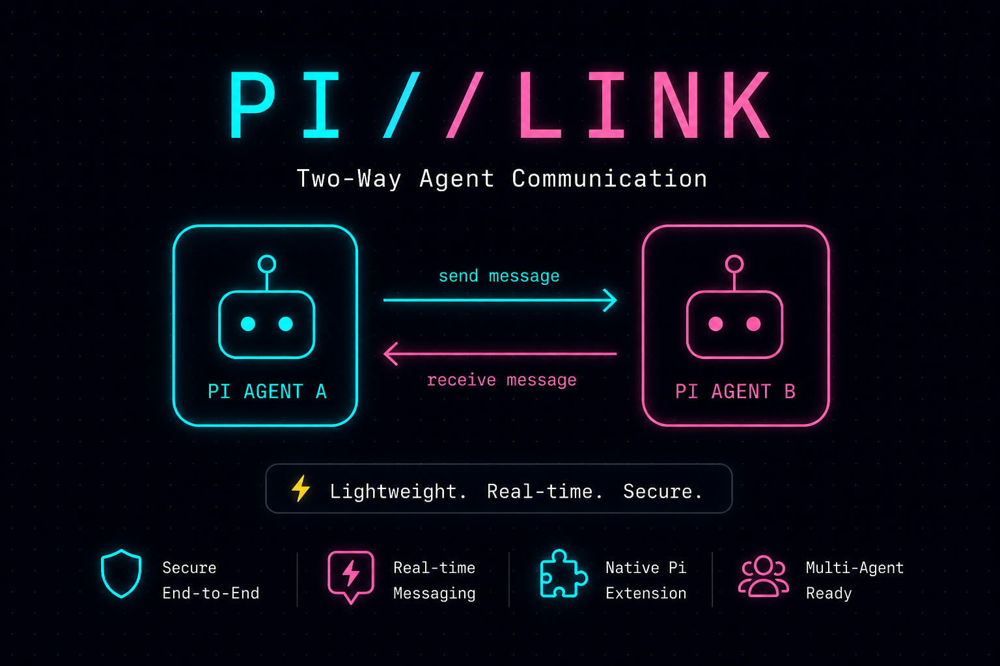
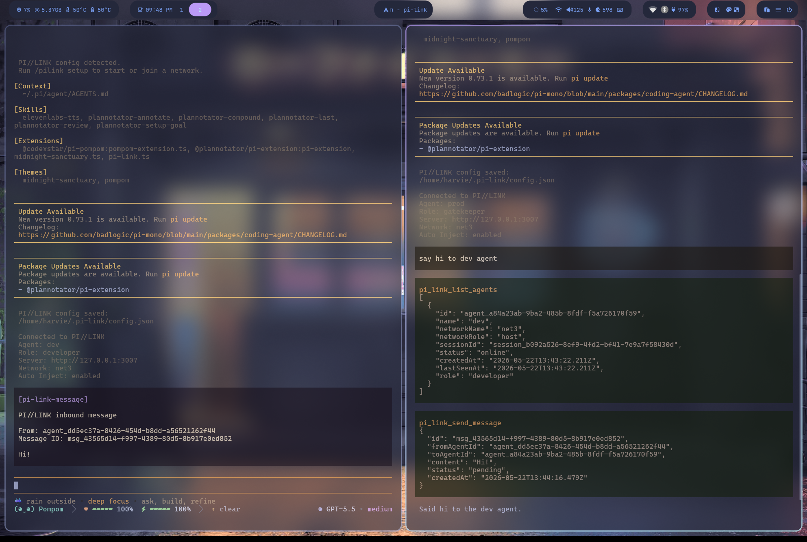

# PI//LINK

Local and LAN messaging for Pi agents.

PI//LINK gives separate Pi agents a lightweight way to talk to each other without merging their sessions or adding an orchestration layer.

> PI//LINK is a Pi extension. You need the Pi agent installed before using it.

<p align="center">
  
</p>

## Pi-to-Pi Agent Communication

One Pi agent is useful. Two Pi agents become more useful when they can actually talk to each other.

PI//LINK adds a peer-to-peer communication layer for Pi agents. Instead of forcing every task through one shared session, agents can stay in their own workspaces and pass messages across a small local or LAN network.

A prod agent can ask a dev agent for implementation help. A dev agent can send status, context, or review notes back. The message appears inside the receiving agent's own active Pi session, so communication feels native to the agent workflow instead of external to it.

PI//LINK does not create a hierarchy. There is no orchestrator and no parent/child chain. It is two Pi agents talking directly, with the user still in control of when either agent continues.

## Demo

<p align="center">
  <a href="https://drive.google.com/file/d/1iVPD2mTiJDlVJ11r9zQj3Ii7fCpuPRrk/view?usp=sharing">
    
  </a>
</p>

<p align="center">
  <a href="https://drive.google.com/file/d/1iVPD2mTiJDlVJ11r9zQj3Ii7fCpuPRrk/view?usp=sharing">Watch the full demo</a>
</p>

In this demo, the left terminal is the dev agent and the right terminal is the prod agent. The prod agent is prompted to say hi to the dev agent, PI//LINK sends the message through the local network, and the dev agent receives it as an inbound message injected into its own active Pi session.

## How It Works

```txt
Pi Agent A <-> PI//LINK Server <-> Pi Agent B
```

> Architecture image placeholder: local/LAN Pi agents connected through the PI//LINK HTTP/SSE server.

Agents register with a PI//LINK server, discover peers in the same network, and send messages over HTTP. Live delivery uses Server-Sent Events, so receiving agents can see inbound messages as they arrive.

The server keeps state in memory for now. Networks are runtime sessions, not permanent rooms.

## Supported Modes

| Mode | Status | Behavior |
| --- | --- | --- |
| `local` | Working now | Uses `http://127.0.0.1:3007`. Setup can start the managed local server automatically. |
| `lan` | Working now | Connects to a server URL on a trusted local network. PI//LINK never auto-starts a server in LAN mode. |
| `remote` | Future update | Planned for hosted or Tailscale-backed workflows. Not implemented yet. |

## Quick Start

### Prerequisite

Install and verify the Pi agent first. PI//LINK runs inside Pi; it is not a standalone chat client.

### Option 1: Clone This Repo Today

Clone the repository and install dependencies:

```bash
git clone git@github.com:harvszxst/pi-link.git
cd pi-link
bun install
bun run check
```

Start Pi with the extension from this checkout:

```bash
pi -e ./extensions/pi-link.ts
```

Inside Pi, run:

```txt
/pilink setup
/pilink agents
/pilink send
```

> Terminal screenshot placeholder: `/pilink setup`, `/pilink agents`, and `/pilink send` flow.

For the first agent, choose `local` mode and `create network`. For the second agent, choose `local` mode and `join network` with the same network name.

In local mode, setup can start the managed PI//LINK server automatically. In LAN mode, provide the server URL for an already-running PI//LINK server on your trusted local network.

### Option 2: Installed Pi Extension Coming Later

PI//LINK is intended to become a normal installable Pi extension in a future release. After packaging and extension integration are complete, the intended flow is:

```bash
pi
```

Then inside Pi:

```txt
/pilink setup
```

No install command is documented for this path yet because packaged Pi extension distribution is still future work.

## Core Commands

```txt
/pilink setup
/pilink agents
/pilink send
/pilink inbox
/pilink status
/pilink server start
/pilink server stop
/pilink doctor
```

## Runtime Model

PI//LINK currently uses one-time runtime networks.

- `/pilink setup` creates or joins the current network.
- The host is the agent that chooses `create network`.
- Members are agents that choose `join network`.
- If the host quits Pi, that network is no longer available.
- Members receive a warning and sending is blocked until they start or join a new network.
- Runtime state such as agent IDs, session IDs, SSE status, and connection status is not persisted.

Saved config stores preferences only.

## Use Cases

- A reviewer agent sends feedback to an implementation agent.
- A gatekeeper agent receives summaries from development agents.
- Multiple local agents coordinate without a full orchestration system.
- LAN-connected machines test agent collaboration on a trusted network.

## Current Limitations

- Requires the Pi agent.
- Local and LAN modes are available now; remote mode is not implemented yet.
- Server state is in memory only.
- No authentication or encryption yet.
- No persisted network/session restore yet.
- Not intended as a production orchestration platform yet.
- Packaged Pi extension installation is future work.

## Deeper Docs

- [Core Functionality](docs/core-functionality.md)
- [Runtime UX Spec](specs/runtime-ux.md)
